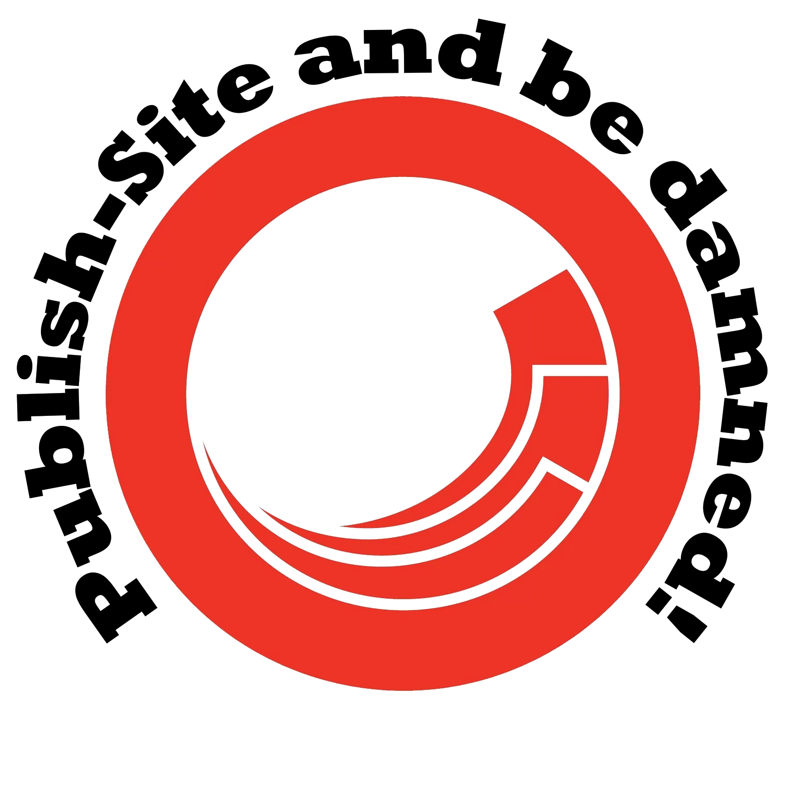

# Stickers from the 2017 Sitecore Symposium and MVP Summit

Various people asked about getting more of the collection of silly stickers I had at Symposium this year.
Since everyone's spread across the globe, I figured it would be easiest to publish the artwork so that you can re-print them, or create your own variations.

The files are available in Photoshop format, and as PNGs below.
They're under an "<a href="http://creativecommons.org/licenses/by-sa/4.0/">attribution, share-alike</a>" license so if you've got customisations you'd like to make, go ahead.
Just give the artwork back to the community and link back to this repo.

For Symposium, I used <a href="https://www.stickermule.com/uk/custom-stickers">Sticker Mule</a> to print copies of these, and the quality was great.
It's a bit hidden, but they also have <a href="https://www.stickermule.com/samples/stickers">an "order samples" option</a>, which lets you get smaller numbers if you only need a few (or to check out your designs).

## General stickers

1. **Endorsed by Robbert Hock** 
     
    [<a href="Hock.psd">PSD File</a>]

2. **Publish Site** 
     
    [<a href="PublishSite.psd">PSD File</a>]

3. **This Machine** 
     
    [<a href="Machine.psd">PSD File</a>]

4. **Myrtle McMuffin** 
     
    [<a href="Myrtle.psd">PSD File</a>] 

## MVP stickers

1. **Fancy Lawnmower** 
     
    [<a href="FancyLawnmower.psd">PSD File</a>]

2. **Wizard** 
     
    [<a href="Wizard.psd">PSD File</a>]

3. **MVP** 
     
    [<a href="MVP.psd">PSD File</a>]

----

Logos used here belong to their respective companies.

----

 This work is licensed under a <a rel="license" href="http://creativecommons.org/licenses/by-sa/4.0/">Creative Commons Attribution-ShareAlike 4.0 International License</a>.